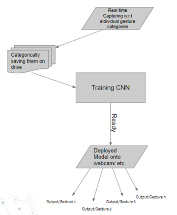

# GestRecognizer
This project is particularly entitled to classify and recognize hand gestures in real time (via a web camera) using the data set that was used to train a Deep Learning model (Convolutional Neural Network). Posture datasets that are used by the this project can be generated by anyone by using the separate data generator module I’ve created. Thus, this project can be of many uses, for example; for mute people to communicate only via a webcam or segmenting an displaying a couple of other gestures.
I’ve used it to categorize and recognize lesser known offensive gestures, which if used in a web-cam accessed real-time media, can help or warn the user regarding the same. The motive here was to inculcate better portrayal of a user’s character in this virtualized world that is undergoing globalization rapidly where people will some-where have to communicate with each other living in distinct corners of world. 

How to make it work:
    
  First RUN 'generatedata.py'  
        You can alter the number of datasets here; including the test train split. i used 100:500  i.e 20% to test. Capture data using green box.
        
  After you get the datasets stored in the folder, RUN 'cnn train.py' this trains the cnn.
  
  Then RUN 'main.py' for realtime classification

